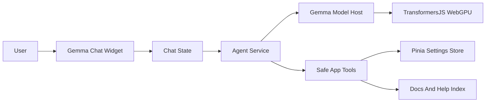

# Gemma Help Chatbot Plan

## Approach

Build a floating assistant that runs Gemma 4 locally through `@huggingface/transformers` with WebGPU. Use `gemma-gem` as the reference for model loading, streaming, model selection, and agent/tool patterns, but replace Chrome extension offscreen/service-worker messaging with Vue services and a dedicated browser worker or lazy singleton service.

The floating widget will be available across all screens. The current empty Help tab can remain as a lightweight “open assistant” landing page or be removed later, but the primary entry point will be the floating chat button.

## Key Files

- `frontend/package.json`: add browser AI/chat dependencies such as `@huggingface/transformers`, `@kessler/gemma-agent`, and `marked`.
- `frontend/src/components/main-component.vue`: mount the floating assistant globally near the workspace shell.
- `frontend/src/components/assistant/gemma-chat-widget.vue`: new floating UI inspired by `gemma-gem/content/chat-overlay.ts`, adapted to Vue and the existing visual language.
- `frontend/src/services/gemma/model-host.js`: Vue/Vite version of `gemma-gem/offscreen/model-host.ts`, using `Gemma4ForConditionalGeneration`, `AutoProcessor`, `TextStreamer`, local ORT wasm paths, streaming, abort, unload, and progress callbacks.
- `frontend/src/services/gemma/agent-service.js`: wraps `@kessler/gemma-agent`, owns conversation history, system prompt, streaming events, and safe tool execution.
- `frontend/src/services/gemma/models.js`: model catalog copied conceptually from `gemma-gem/shared/models.ts`, defaulting to `onnx-community/gemma-4-E2B-it-ONNX` because it is the lighter option.
- `frontend/src/services/gemma/tools.js`: safe tools for reading app context, navigating tabs, explaining current model/result, listing selected features, and summarizing dataset health/results.
- `frontend/src/services/gemma/help-context.js`: compact knowledge source from `help-component.vue`, `documentation-component.vue` algorithm metadata, current result metadata, and common workflow guidance.
- `frontend/src/components/tabs/classification-view-component.vue` and `frontend/src/components/tabs/regression-view-component.vue`: change “Method description” buttons to open the floating assistant with model-specific context instead of trying to scroll to broken static IDs.

## Implementation Steps

1. Add dependencies and configure local runtime assets.
   - Install `@huggingface/transformers`, `@kessler/gemma-agent`, and `marked`.
   - Copy ONNX Runtime wasm files into `frontend/public/ort` and set `env.backends.onnx.wasm.wasmPaths` to that public path.
   - Keep the default model as Gemma 4 E2B; expose E4B as an advanced option because it is much larger.

2. Build the local model host.
   - Port the core pattern from `gemma-gem/offscreen/model-host.ts`.
   - Replace `chrome.runtime.getURL('ort/')` with a Vite-safe public URL.
   - Add WebGPU and `shader-f16` checks with clear UI errors.
   - Support load progress, streaming chunks, stop generation, unload model, and model switching.

3. Create the agent service and tools.
   - Use `@kessler/gemma-agent` for the agent loop.
   - Provide safe app tools rather than arbitrary page JavaScript: read current tab, current dataset summary, selected features, active model config, available results, result metrics, and method documentation context.
   - Add a navigation tool that can open major app tabs through `settings.setActiveTab`.
   - Avoid destructive tools by default.

4. Build the floating chat UI.
   - Add a compact floating button and expandable panel.
   - Show model status, load progress, WebGPU compatibility warnings, selected model, stop button, clear chat, and suggested prompts.
   - Render markdown responses using `marked`.
   - Persist lightweight chat settings in `localStorage`.

5. Replace current help entry behavior.
   - Mount the floating widget once in `main-component.vue`.
   - Update “Method description” in classification/regression result cards to open the assistant with a prompt/context like: “Explain Logistic Regression for this result, including metrics and diagnostics.”
   - Optionally make the Help tab display a short assistant landing state instead of being empty.

6. Create ML/app-specific system context.
   - Include concise app identity: ML Fit / ML Studio assistant.
   - Include current screen context, dataset shape, target column, selected task, latest model/result metadata, and documentation snippets.
   - Keep context bounded so browser inference stays responsive.

7. Verify performance and compatibility.
   - Run lint/build checks.
   - Test Chrome/WebGPU happy path, no-WebGPU fallback, first model download progress, reload after cache, stop generation, method button context, and tab navigation tool.
   - Confirm the app still works when the model is not loaded or unsupported.

## Important Constraints

- This will run fully in the browser, so first load can be large: Gemma 4 E2B is about 500MB and E4B is about 1.5GB.
- Chrome/WebGPU with f16 shader support is the realistic target.
- The Chrome-extension offscreen architecture from `gemma-gem` cannot be copied directly into this Vue app; we will reuse the model-host and agent ideas, then implement web-app-native wiring.
- Tooling should be app-safe: inspect and navigate first, no arbitrary JavaScript execution unless explicitly added later.