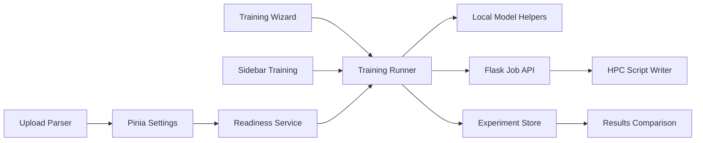

# Phase 1 Trust and Flow Plan

## Scope
Deliver the Phase 1 roadmap from `feature.md`: Unified Experiment Runner, Intelligent Data Health and Readiness Score, Experiment History/Reproducibility, API base URL alignment, upload/parser fixes, and a structured backend job protocol. The first user-visible outcome will be guided ML readiness: after upload and before training, the app should explain whether the dataset is ready, what risks exist, and how the training run will proceed.

Out of scope for this first implementation: full collaboration, multi-user auth, complete job center UI with cancellation/log streaming, advanced AutoML benchmarks, report composer, and all Phase 2-4 roadmap items.

## Target Architecture

## Implementation Steps

1. Stabilize API and upload contracts.
- Add a frontend API client/config helper using `VITE_API_BASE`, replacing hardcoded `http://127.0.0.1:5000` in [frontend/src/components/sidebar-component.vue](frontend/src/components/sidebar-component.vue) and [frontend/src/components/tabs/classification-view-component.vue](frontend/src/components/tabs/classification-view-component.vue).
- Gate unsupported Excel uploads unless parser support is actually implemented, so `.xlsx` no longer appears selectable while [frontend/src/helpers/parser/parser_factory.js](frontend/src/helpers/parser/parser_factory.js) only supports CSV/TXT.
- Add `.env.example` notes for frontend/backend ports.

2. Add task-aware readiness service.
- Create [frontend/src/services/data-readiness/readiness-service.js](frontend/src/services/data-readiness/readiness-service.js).
- Extract reusable profiling from [frontend/src/components/dataset-health-component.vue](frontend/src/components/dataset-health-component.vue) into service functions for missingness, duplicates, constants, cardinality, class imbalance, skew/outliers, target suitability, and leakage-like columns.
- Return a deterministic object: score, task mode, blockers, warnings, suggestions, target candidates, feature exclusions, and plain-language explanations.
- Surface it in Data Analysis and the wizard dataset step, with pre-train warnings prioritized over passive display.

3. Create unified training runner.
- Create [frontend/src/services/training/training-runner.js](frontend/src/services/training/training-runner.js) as the shared orchestration boundary for sidebar and wizard.
- Start by extracting the current local training path from [frontend/src/components/sidebar-component.vue](frontend/src/components/sidebar-component.vue) without changing model helper internals.
- Provide `validateConfig`, `prepareDataset`, `runLocal`, `runHpc`, `pollProgress`, and `normalizeResult` methods.
- Replace simulated wizard progress in [frontend/src/App.vue](frontend/src/App.vue) with runner lifecycle updates.
- Keep `settings.addResult` compatible while introducing normalized run metadata.

4. Add experiment history and reproducibility foundation.
- Extend [frontend/src/stores/settings.js](frontend/src/stores/settings.js) with a `trainingRuns` collection and lightweight run metadata.
- Add [frontend/src/services/experiments/experiment-store.js](frontend/src/services/experiments/experiment-store.js) using IndexedDB with a localStorage fallback only for minimal metadata if IndexedDB is unavailable.
- Persist serializable experiment records only: config, seed, dataset fingerprint, metrics, status, warnings, execution backend, timestamps, and artifact references. Do not persist live model objects or large Danfo snapshots.
- Add export JSON and rerun/clone hooks at the service/store layer; UI can start with basic restored history in results.

5. Normalize backend job protocol.
- Update [backend/app.py](backend/app.py) so `/run` and `/progress` always return JSON status objects instead of mixing text, 204 responses, and raw result payloads.
- Fix the HPC filename mismatch by passing the uploaded filename into [backend/helpers/commnad_write.py](backend/helpers/commnad_write.py) rather than hardcoding `main.csv`.
- Include a run manifest in completed job responses: `job_id`, `method_name`, `target`, `seed`, `status`, timestamps where available, and normalized metrics/artifacts.
- Keep the current `/run` and `/progress` routes for compatibility; defer the larger `/jobs/<id>/logs/cancel/artifacts` API until the next phase.

6. Verification and tests.
- Add frontend unit tests for readiness scoring edge cases, runner validation/result normalization, API base URL resolution, and unsupported file type behavior.
- Add component tests for wizard/sidebar using mocked runner responses where practical.
- Add backend tests for JSON `/run` and `/progress`, filename propagation into generated scripts, and completed job manifest shape.
- Run the relevant suites: backend `pytest`, frontend `npm run test:unit`, and `npm run build` from [frontend/package.json](frontend/package.json).

## Delivery Order

The safest order is: API/upload fixes, readiness service, runner extraction, experiment persistence, backend job normalization, then UI polish and verification. This keeps the existing app usable after each step and makes ML guidance visible early.

## Main Risks

- `sidebar-component.vue` currently owns a lot of training logic, so the runner extraction should be incremental and covered by tests rather than a wholesale rewrite.
- Persisting experiments must avoid non-serializable model objects and large dataframe snapshots.
- HPC cannot be fully end-to-end verified without real cluster credentials, so backend tests should mock SSH/SFTP and assert the contract and generated script behavior.