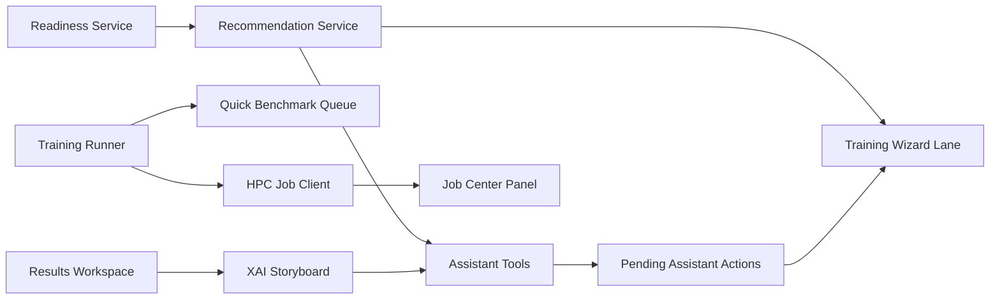

# Phase 2 Differentiation Plan

## Scope
Deliver all Phase 2 roadmap areas from `feature.md`: ML Copilot actionable tools, Explainability Storyboard, AutoML Recommendation Lane, Seamless HPC Job Center, and Performance Architecture. The priority outcome is the “wow guidance” flow: after upload, the app recommends what to do next, proposes sensible models, can configure a draft training run with confirmation, and explains results in plain language.

Out of scope for this phase: multi-user auth, collaboration reports, dataset lineage, full server-side method registry beyond the existing LDA/QDA HPC path, and worker-backed full benchmark parallelism if it would require rewriting model helpers.

## Target Architecture

## Implementation Steps

1. Add performance foundations first.
- Lazy-load [frontend/src/components/assistant/gemma-chat-widget.vue](frontend/src/components/assistant/gemma-chat-widget.vue) from [frontend/src/components/main-component.vue](frontend/src/components/main-component.vue) so assistant code is not part of the initial interaction path.
- Add Vite manual chunks in [frontend/vite.config.js](frontend/vite.config.js) for visualization, TensorFlow/Danfo/Plotly, Gemma/Transformers, and core app chunks.
- Add a lightweight bundle budget script or build-time check that reports oversized chunks without blocking development unexpectedly.
- Keep existing dynamic loaders in [frontend/src/utils/danfo_loader.js](frontend/src/utils/danfo_loader.js) intact.

2. Build the rule-based AutoML recommendation lane.
- Create [frontend/src/services/recommendations/recommendation-service.js](frontend/src/services/recommendations/recommendation-service.js).
- Consume [frontend/src/services/data-readiness/readiness-service.js](frontend/src/services/data-readiness/readiness-service.js), task mode, row/column counts, numeric/categorical ratio, missingness, class imbalance, and model metadata from [frontend/src/helpers/settings.js](frontend/src/helpers/settings.js).
- Return ranked candidates with labels for speed, interpretability, robustness, expected training cost, and why each model is recommended.
- Surface the top recommendations in [frontend/src/components/tabs/model-training-wizard.vue](frontend/src/components/tabs/model-training-wizard.vue) near dataset/algorithm selection.
- Add a first version of “Quick benchmark” that runs 2-3 safe, lightweight candidates serially through the existing runner and results flow; add cancellation hooks even if worker-backed parallelism is deferred.

3. Add assistant actionable tools with confirmation.
- Expand [frontend/src/services/gemma/tools.js](frontend/src/services/gemma/tools.js) with `recommend_next_step`, `diagnose_dataset`, `suggest_model_config`, `explain_metric`, `compare_runs`, `create_report_outline`, and `configure_training_draft`.
- Add `pendingAssistantActions` to [frontend/src/stores/settings.js](frontend/src/stores/settings.js), with actions to add, approve, apply, dismiss, and clear assistant drafts.
- Keep state-changing assistant behavior behind confirmation in [frontend/src/components/assistant/gemma-chat-widget.vue](frontend/src/components/assistant/gemma-chat-widget.vue).
- Reuse existing app wiring in [frontend/src/App.vue](frontend/src/App.vue) and sidebar `syncFromWizard` so an approved training draft can configure the wizard/sidebar without directly mutating hidden state.
- Add Vitest coverage for tool argument validation, pure tool outputs, and approval queue behavior.

4. Create the Explainability Storyboard.
- Create an XAI normalizer service, likely [frontend/src/services/explainability/xai-normalizer.js](frontend/src/services/explainability/xai-normalizer.js), to normalize local and HPC `pfi`, `pdp_grid`, `pdp_avgs`, ROC/probability, residual, and metric payloads.
- Add a storyboard component under results, for example [frontend/src/components/tabs/xai-storyboard-component.vue](frontend/src/components/tabs/xai-storyboard-component.vue), and mount it from [frontend/src/components/tabs/results-component.vue](frontend/src/components/tabs/results-component.vue).
- Reuse existing chart behavior from [frontend/src/helpers/charts.js](frontend/src/helpers/charts.js), [frontend/src/components/tabs/classification-view-component.vue](frontend/src/components/tabs/classification-view-component.vue), and [frontend/src/components/tabs/regression-view-component.vue](frontend/src/components/tabs/regression-view-component.vue).
- Include guardrails for unsupported models and at least one narrative insight per supported run: model summary, confusion/residual diagnosis, feature importance, partial dependence caveats, and next experiment suggestion.
- Let assistant `explain_metric` and result-specific prompts reference storyboard summaries.

5. Add the HPC Job Center foundation.
- Add a backend job service layer around [backend/app.py](backend/app.py) and [backend/helpers/commnad_write.py](backend/helpers/commnad_write.py) to parse Slurm job IDs, build job manifests, and preserve the existing `/run` and `/progress` routes.
- Add new endpoints before the SPA catch-all: `POST /jobs`, `GET /jobs/<job_id>`, `GET /jobs/<job_id>/logs`, `POST /jobs/<job_id>/cancel`, and `GET /jobs/<job_id>/artifacts`.
- Create a frontend job client at [frontend/src/services/jobs/job-client.js](frontend/src/services/jobs/job-client.js) and a Job Center panel, likely integrated into Messages or a new results-adjacent panel.
- Store `hpcJobs` or reuse `trainingRuns` in [frontend/src/stores/settings.js](frontend/src/stores/settings.js) so local and HPC runs share one timeline concept.
- Migrate ad-hoc polling in [frontend/src/components/tabs/classification-view-component.vue](frontend/src/components/tabs/classification-view-component.vue) toward the job client while keeping compatibility.

6. Extend the shared training runner for Phase 2 flows.
- Add `recommend`, `runQuickBenchmark`, `runHpc`, `pollProgress`, and cancellation-oriented hooks to [frontend/src/services/training/training-runner.js](frontend/src/services/training/training-runner.js).
- Keep the first benchmark implementation conservative and serial, using existing sidebar/model helper behavior rather than rewriting training internals.
- Normalize all resulting records into experiment history so recommendations, benchmarks, and HPC jobs appear in the same Results/History surfaces.

7. Verification.
- Add frontend unit tests for recommendation rules, assistant tools, pending assistant action store behavior, XAI normalization, job client parsing, and runner benchmark orchestration.
- Add backend tests for new `/jobs` endpoints, Slurm ID parsing, logs/artifacts/cancel behavior with mocked SSH, and legacy `/run`/`/progress` compatibility.
- Run backend `python -m pytest backend/tests`, frontend `npm run test:unit`, frontend `npm run build`, and lints/diagnostics for edited files.

## Delivery Order

Start with performance/lazy loading, then recommendations, then assistant tools, then storyboard, then job center, then benchmark/runner expansion. This gives the user-visible recommendation win early while reducing initial bundle risk before expanding assistant capabilities.

## Main Risks

- Quick benchmark can freeze the UI if too many models run on large data; keep the initial version small and cancellable.
- State-changing assistant tools need a confirmation queue; direct mutation would reduce trust.
- HPC cancel/logs require a Slurm job ID and a manifest store; without that, Job Center features become unreliable.
- Storyboard must handle unsupported explainability gracefully, because not every current model exposes PFI/PDP/probability data.
- Build may remain heavy because existing Plotly, TensorFlow, Danfo, Transformers, and ONNX assets are large; chunking improves loading behavior but does not remove asset size.