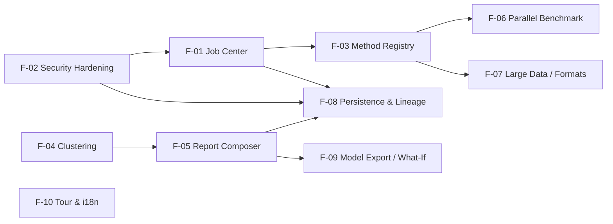

# Stat-ML-Fit — Next-Stage Feature Plan (Phase 3)

**Status:** Proposed
**Date:** 2026-06-11
**Scope:** Prioritized features for the platform's next development stage, derived from an end-to-end review of all functional modules, technical infrastructure, user workflows, and existing implementations.

---

## Table of Contents

1. [Platform Review Summary](#1-platform-review-summary)
2. [Prioritization Framework](#2-prioritization-framework)
3. [P0 Features (Foundation — must ship first)](#3-p0-features)
   - [F-01 Unified HPC Job Center (end-to-end)](#f-01-unified-hpc-job-center-end-to-end)
   - [F-02 Security Hardening & Job Isolation](#f-02-security-hardening--job-isolation)
   - [F-03 Server-Side Method Registry (HPC beyond LDA/QDA)](#f-03-server-side-method-registry-hpc-beyond-ldaqda)
4. [P1 Features (Differentiation — next wave)](#4-p1-features)
   - [F-04 Clustering & Unsupervised Learning End-to-End](#f-04-clustering--unsupervised-learning-end-to-end)
   - [F-05 Report Composer & Shareable Exports](#f-05-report-composer--shareable-exports)
   - [F-06 Parallel AutoML Benchmark Lane](#f-06-parallel-automl-benchmark-lane)
   - [F-07 Large-Dataset & Expanded Format Support](#f-07-large-dataset--expanded-format-support)
5. [P2 Features (Expansion — after P0/P1 land)](#5-p2-features)
   - [F-08 Server-Side Experiment Persistence & Dataset Lineage](#f-08-server-side-experiment-persistence--dataset-lineage)
   - [F-09 Model Export & What-If Prediction Studio](#f-09-model-export--what-if-prediction-studio)
   - [F-10 Guided Onboarding Tour & Localization (DE/EN)](#f-10-guided-onboarding-tour--localization-deen)
6. [Delivery Sequencing & Dependencies](#6-delivery-sequencing--dependencies)
7. [Roadmap Alignment](#7-roadmap-alignment)
8. [Complexity & Effort Summary](#8-complexity--effort-summary)

---

## 1. Platform Review Summary

This plan is grounded in a full review of the codebase as it stands today.

### What exists and works

| Module | State |
|--------|-------|
| **Data upload & EDA** | CSV/TXT upload with parser factory (`frontend/src/helpers/parser/`), danfojs DataFrames, dataset health/readiness score (`services/data-readiness/readiness-service.js`), correlations, distributions, SPLOM, parallel coordinates |
| **Browser-side training** | 7 classification + 8 regression models via Pyodide/sklearn (`helpers/webworker.js`, `helpers/model_factory.js`) and webR/glmnet for linear/polynomial regression; CV, imputation, outlier removal, encoding/scaling, optional PCA |
| **Dimensionality reduction** | PCA, t-SNE (Pyodide), UMAP (umap-js), autoencoder (TensorFlow.js) |
| **Explainability** | PFI, PDP, XAI normalizer + storyboard with narrative insights (`services/explainability/xai-normalizer.js`, `tabs/xai-storyboard-component.vue`) |
| **AI assistant** | In-browser Gemma 4 (ONNX/WebGPU) with safe app tools, recommendation lane, pending-action approval queue (`services/gemma/`) |
| **AutoML guidance** | Rule-based recommendation service + serial quick benchmark (`services/recommendations/recommendation-service.js`) |
| **Experiment history** | IndexedDB persistence of runs (`services/experiments/experiment-store.js`), Pinia store (`stores/settings.js`) |
| **Backend** | Thin Flask API (`backend/app.py`): `/health`, `/upload`, `/missforest`, `/run`, `/progress`, `/jobs/*`; SSH/Slurm bridge to TU Dresden Barnard HPC (`helpers/ssh_client.py`, `helpers/commnad_write.py`) |
| **Infra & ops** | Nginx + Docker on SCADS VM, GitHub Actions deploy, VM bootstrap/deploy scripts, pytest (12 backend tests) + Vitest (30 spec files, 80% coverage targets) |

### Key gaps confirmed by the review (drives this plan)

1. **HPC Job Center is a stub.** `POST /jobs` returns metadata but never submits to Slurm; the real path is the legacy side-effecting `GET /run`. Slurm job IDs from `sbatch` output are not parsed or stored, so cancel/logs are unreliable. `hpc-job-center-component.vue` is a read-only list that nothing populates.
2. **HPC training supports only LDA/QDA** (hardcoded script template in `commnad_write.py`), while the browser supports 15 model types. The HPC value proposition is severely limited.
3. **Security debt** (per `ISSUES.md`): SSH `AutoAddPolicy()` (MITM risk), password-based HPC auth, path-traversal risk on `/run?file_name=`, no upload cleanup, no auth of any kind.
4. **Clustering is UI-disabled** (`model-training-wizard.vue` `disabled: true`) — documented in the education tab only, no training pipeline.
5. **Silent 10,000-row sampling cap**; CSV/TXT only (no `.xlsx` despite earlier UI promises).
6. **No persistence beyond the browser** — experiments live in IndexedDB; no sharing, no lineage, no multi-device continuity.
7. **Unused installed capabilities**: `jspdf` (reports), `shepherd.js` (tours), xgboost WASM, `tfjs-tsne`/`tfjs-vis`, `scikitjs`, `ml-hclust` — partially anticipating features in this plan.

---

## 2. Prioritization Framework

Features are prioritized by:

- **P0** — unblocks the platform's core HPC promise and removes risks that would compromise everything built on top.
- **P1** — visible product differentiation for the target audience (students, researchers, practitioners at TU Dresden/SCADS).
- **P2** — expansion features that require P0 foundations (auth, persistence) or are polish.

Complexity scale: **S** (≤1 week), **M** (1–3 weeks), **L** (3–6 weeks), **XL** (6+ weeks), assuming one engineer familiar with the codebase.

---

## 3. P0 Features

### F-01 Unified HPC Job Center (end-to-end)

**Priority:** P0 · **Complexity: L**

#### Core business value

The HPC integration is the platform's headline differentiator ("offload heavy computation to TU Dresden HPC") yet today it is a half-wired legacy path. Users cannot reliably see, cancel, or inspect jobs. Completing the Job Center converts the HPC story from a demo into a dependable product capability, and is a prerequisite for F-03 (method registry) and F-06 (benchmark lane offload).

#### Functional requirements

1. **Single job lifecycle API.** All HPC submissions go through `POST /jobs` (JSON body: dataset ref, method, hyperparameters, target, seed, explain flag). Retire `GET /run` for new submissions; keep it as a deprecated alias for one release.
2. **Slurm job ID capture.** Parse `sbatch` output (`Submitted batch job <id>`) at submission time; persist `{job_id → slurm_id, manifest, timestamps, status}` in a server-side job manifest store.
3. **Status state machine.** `queued → submitted → running → completed | failed | cancelled`, derived from `squeue`/`sacct` polling plus `res.json` presence, exposed via `GET /jobs/<id>`.
4. **Live log streaming.** `GET /jobs/<id>/logs?stream=true` tails `slurm.out`/`slurm.err` over SSH (chunked response or polling cursor); Job Center UI shows the last N lines with auto-refresh.
5. **Reliable cancel.** `POST /jobs/<id>/cancel` uses the stored Slurm ID; UI confirms outcome.
6. **Job Center UI completion.** `hpc-job-center-component.vue` becomes a live panel: job table (status, runtime, method, dataset), per-job detail drawer (logs, manifest, artifacts), cancel/retry buttons. Populate `settings.hpcJobs` from the job client on app load and on submission.
7. **Unified timeline.** Local runs (IndexedDB experiment store) and HPC jobs appear in one Results/History timeline with a source badge.
8. **Failure UX.** Slurm failures (OOM, timeout, missing venv) surface as human-readable messages, with the assistant able to explain them via a new `explain_job_failure` Gemma tool.

#### Technical implementation prerequisites

- Server-side job manifest store: start with a JSON/SQLite file in the existing `backend-files` Docker volume (no new infra); design the access layer so F-08's database can replace it.
- `sbatch`/`squeue`/`sacct` output parsers with unit tests (mocked SSH, following the existing `pytest-mock` pattern in `backend/tests/`).
- Refactor `backend/app.py` route handlers into a `backend/services/jobs.py` module (thin routes, logic in plain functions — the codebase convention).
- Frontend: extend `services/jobs/job-client.js` (already exists) and migrate the 3-second polling loop out of `classification-view-component.vue` into `services/training/training-runner.js` (`runHpc`/`pollProgress` hooks already stubbed in Phase 2).

#### Integration points

- `backend/app.py`, `backend/helpers/ssh_client.py`, `backend/helpers/commnad_write.py`
- `frontend/src/services/jobs/job-client.js`, `frontend/src/services/training/training-runner.js`
- `frontend/src/components/jobs/hpc-job-center-component.vue`, `tabs/results-component.vue`, `stores/settings.js` (`hpcJobs`, `upsertHpcJob`)
- `frontend/src/services/gemma/tools.js` (new failure-explanation tool)

#### Success metrics

- 100% of HPC submissions have a captured Slurm ID and resolvable terminal status.
- Cancel success rate > 95% on running jobs (measured against `scancel` exit codes).
- Job Center reflects status changes within ≤ 10 s of cluster state change.
- Zero submissions through `GET /run` after one release cycle.
- Backend test suite covers submit/poll/logs/cancel/fail paths (≥ 15 new tests).

---

### F-02 Security Hardening & Job Isolation

**Priority:** P0 · **Complexity: M**

#### Core business value

The platform handles researcher datasets and holds credentials to a national HPC cluster. The open issues (`ISSUES.md` ISSUE-003/004/005/008) are not theoretical: MITM on SSH, path traversal on `/run`, indefinite retention of uploaded data. Fixing these protects the SCADS/TU Dresden deployment, is a hard prerequisite for any multi-user feature (F-08), and reduces institutional risk for a publicly reachable site (`stat-ml-fit.scads.ai`).

#### Functional requirements

1. **Key-based SSH auth.** Replace `HPC_PASSWORD` with `HPC_KEY_PATH` (Ed25519 key mounted into the container); remove the `constants.py` fallback entirely.
2. **Host key pinning.** Replace `AutoAddPolicy()` with a known-hosts file (`HPC_KNOWN_HOSTS` env) and `RejectPolicy` for unknown hosts.
3. **Path-safe file access.** All `file_name` inputs validated with `werkzeug.utils.secure_filename` plus a resolved-path containment check against `backend/files/`; reject otherwise with a 400.
4. **Upload lifecycle management.** Configurable TTL (default 24 h) for uploaded CSVs and downloaded result JSONs; background cleanup task; document retention in the UI upload dialog.
5. **Request validation.** Pydantic (or marshmallow) schemas for all POST bodies (`/missforest`, `/jobs`, `/upload` metadata); uniform error envelope `{"data": ..., "error": ...}` across all endpoints (closes ISSUE-012/020).
6. **Structured logging.** Replace residual `print()` with the `logging` module; request-ID correlation between API logs and HPC job manifests (closes ISSUE-014).
7. **Rate limiting** on `/upload` and `/jobs` (simple in-process limiter is sufficient pre-auth) to protect the shared HPC account.

#### Technical implementation prerequisites

- Generate and register an SSH keypair for the `mlfit` HPC service account; update `deploy/env.example` and `deployment.md` accordingly.
- Add `pydantic` to `backend/requirements.txt`; remove unused `lightgbm`.
- A scheduled cleanup mechanism: a simple thread/`APScheduler` job inside the Flask container is acceptable given the single-container deployment.
- Update GitHub Actions secrets and VM `.env` handling (`scripts/vm-deploy.sh` untouched; only `.env` contents change).

#### Integration points

- `backend/helpers/ssh_client.py` (auth + host key), `backend/app.py` (validation, error envelope, cleanup)
- `frontend/src/services/api/client.js` (consume the unified error envelope; remove the last hardcoded `127.0.0.1:5000` call in `sidebar-component.vue`'s missforest path)
- `deploy/env.example`, `docker-compose.prod.yaml` (key mount), `deployment.md`
- `ISSUES.md` (close ISSUE-003/004/005/008/012/014/020 and update the stale ISSUE-024 testing entry)

#### Success metrics

- Zero password-based SSH connections in production logs.
- Path-traversal probes (e.g. `file_name=../../etc/passwd`) return 400 in automated tests.
- `backend/files/` steady-state disk usage bounded (< 1 GB) on the VM after one week of normal use.
- All endpoints return the unified envelope; frontend error toasts show server-provided messages instead of generic failures.

---

### F-03 Server-Side Method Registry (HPC beyond LDA/QDA)

**Priority:** P0 · **Complexity: L**

#### Core business value

The browser supports 15 model types but the HPC path supports 2 (LDA/QDA), which inverts the value proposition: the heavy compute environment is the *least* capable one. A method registry lets users run any supported model — most importantly Random Forest, Boosting, and SVM on datasets that exceed the browser's 10k-row comfort zone — and is the technical foundation for raising the dataset cap (F-07) and offloading benchmarks (F-06).

#### Functional requirements

1. **Declarative method registry.** A single source of truth (e.g. `backend/methods/registry.py` + mirrored JSON consumed by the frontend) describing each method: id, task type, sklearn estimator, hyperparameter schema (names, types, ranges, defaults), explainability support, resource profile (CPU/mem/time for `sbatch`).
2. **Template-driven script generation.** Replace the hardcoded LDA/QDA string in `commnad_write.py` with a Jinja2-templated runner script: load data → preprocess (reusing the same encoding/imputation semantics the frontend applies) → fit estimator from registry → metrics → optional PFI/PDP → write `res.json` matching the existing XAI-normalizer contract.
3. **Coverage target:** all 7 classification and the 6 Pyodide-backed regression methods (webR linear/polynomial remain browser-only initially; sklearn equivalents can be registered server-side).
4. **Resource-aware submission.** `sbatch` parameters (`--cpus-per-task`, `--mem`, `--time`) come from the registry's resource profile scaled by dataset size, replacing the hardcoded `4 CPU / 4G / 1h`.
5. **Frontend parity.** The wizard and sidebar surface "Run on HPC" for every registry-supported method; the recommendation service (`recommendation-service.js`) can recommend HPC execution when dataset size or model cost warrants it.
6. **Contract conformance.** Server-side `res.json` validates against the same shape the XAI normalizer (`xai-normalizer.js`) consumes, so the storyboard works identically for local and HPC runs.

#### Technical implementation prerequisites

- F-01 (job lifecycle) and F-02 (safe file handling) must land first.
- Pin the HPC virtualenv (`/data/horse/ws/mlfit-python_virtual_environment`) package versions and document them; add a version handshake (runner script reports sklearn version into the manifest).
- Add `jinja2` to backend requirements; golden-file tests for generated scripts per method (extend `backend/tests/test_helpers.py`).
- Define the `res.json` JSON Schema and validate it in both backend tests and a frontend Vitest contract test.

#### Integration points

- `backend/helpers/commnad_write.py` → replaced by `backend/methods/` (registry + templates); rename fixes ISSUE-018 in passing
- `frontend/src/helpers/settings.js` / `model_factory.js` (map frontend model ids ↔ registry ids)
- `frontend/src/components/tabs/model-training-wizard.vue`, `sidebar-component.vue` (HPC toggle per method)
- `frontend/src/services/recommendations/recommendation-service.js` (HPC-aware recommendations)
- `frontend/src/services/explainability/xai-normalizer.js` (shared result contract)

#### Success metrics

- ≥ 13 of 15 model types runnable on HPC with metrics + explainability artifacts.
- HPC and local runs of the same method/seed on the same dataset produce metrics within tolerance (numerical parity test on iris/housing fixtures).
- Zero hand-edited job scripts; 100% of submitted scripts are template-generated and covered by golden tests.
- ≥ 30% of HPC submissions use a non-LDA/QDA method within one month of release.

---

## 4. P1 Features

### F-04 Clustering & Unsupervised Learning End-to-End

**Priority:** P1 · **Complexity: M**

#### Core business value

Clustering is already promised in the README, taught in the documentation tab (with Three.js demos), and visible-but-disabled in the wizard — a credibility gap for the core teaching/research audience. Shipping it completes the platform's "classification, regression, clustering" claim and creates a natural workflow loop with the existing dimensionality-reduction tab (cluster → project → inspect).

#### Functional requirements

1. **Enable the clustering problem type** in `model-training-wizard.vue` (remove `disabled: true`) and in the sidebar task-mode selector (`task_mode.js` gains a `clustering` mode; no target column required).
2. **Methods (browser, Pyodide/sklearn):** K-Means (k, init, n_init), Hierarchical/Agglomerative (linkage, k or distance threshold), DBSCAN (eps, min_samples), Gaussian Mixture (components, covariance type).
3. **Evaluation without labels:** silhouette score, Davies–Bouldin, Calinski–Harabasz; elbow/silhouette plots for k selection; optional adjusted Rand index when the user designates a label column for comparison.
4. **Cluster results view:** new `clustering-view-component.vue` — cluster scatter on PCA/UMAP projection (reusing the DR tab's Plotly logic), per-cluster feature profiles, cluster size table, downloadable cluster assignments as CSV column appended to the dataset.
5. **Pipeline reuse:** imputation, encoding, scaling, and outlier handling from the existing sidebar pipeline apply unchanged; PCA pre-step optional.
6. **Assistant & recommendations:** the recommendation service suggests k ranges and method choices from dataset shape; Gemma tools gain `explain_clusters` (narrate cluster profiles).
7. **Experiment history parity:** clustering runs persist to IndexedDB and appear in Results comparison with task-appropriate metrics.

#### Technical implementation prerequisites

- Extend `ModelFactory` and `helpers/settings.js` `METHODS` with a clustering category; extend the Pyodide worker (`webworker.js`) message protocol for label-free training.
- Task-mode plumbing: `task_mode.js`, store fields (`taskMode`, validation that skips target selection), wizard step 2 branching.
- Chart additions in `helpers/charts.js` (silhouette plot, elbow plot, cluster-colored projections) following existing `ChartController` patterns and `chart-theme.js` theming.

#### Integration points

- `frontend/src/helpers/model_factory.js`, `helpers/settings.js`, `helpers/task_mode.js`, `helpers/webworker.js`
- `frontend/src/components/tabs/model-training-wizard.vue`, `sidebar-component.vue`, new `tabs/clustering-view-component.vue`, `tabs/results-component.vue`
- `frontend/src/components/tabs/dmensionality-reduction-componenet.vue` (shared projection rendering)
- `services/recommendations/recommendation-service.js`, `services/gemma/tools.js`, `services/experiments/experiment-store.js`

#### Success metrics

- 4 clustering methods trainable end-to-end with internal validation metrics and projection plots.
- Wizard completion rate for clustering tasks comparable to classification (instrument via existing message log).
- Documentation tab demos link directly to "try it on your data" wizard prefill.
- ≥ 12 new Vitest specs (methods, task-mode branching, metrics, view component) keeping coverage ≥ 80%.

---

### F-05 Report Composer & Shareable Exports

**Priority:** P1 · **Complexity: M**

#### Core business value

The target users (students writing theses, researchers writing papers) currently screenshot charts by hand. A one-click report — dataset summary, preprocessing decisions, model configuration, metrics, XAI storyboard narrative, and charts — turns each experiment into a citable artifact and is the platform's most natural "share with supervisor" loop. `jspdf` is already a dependency and the assistant already has a `create_report_outline` tool; this feature completes that thread.

#### Functional requirements

1. **Report builder UI** in the Results tab: select runs (one or several for comparison), toggle sections (data health, preprocessing, config, metrics, confusion/residuals, PFI/PDP, storyboard narrative, reproducibility block with seed + versions).
2. **Export formats:** PDF (jspdf + chart-to-image via Plotly `toImage` / Highcharts export) and standalone HTML (self-contained, theme-aware).
3. **Reproducibility block:** dataset fingerprint (name, rows, columns, hash), seed, full hyperparameters, app version, runtime (Pyodide/webR/HPC), generated automatically from the experiment record.
4. **Assistant integration:** Gemma's `create_report_outline` output pre-populates the section selection and narrative text; user edits before export (consistent with the pending-action approval pattern).
5. **Comparison reports:** multi-run reports reuse the existing ranking chart and metrics heatmap from `results-component.vue`.
6. **Methods appendix:** auto-included plain-language method description pulled from the documentation tab's metadata for each model used.

#### Technical implementation prerequisites

- A chart-snapshot utility that renders Plotly/Highcharts instances to PNG at export resolution (both libraries support this natively; needs a shared async wrapper with theming forced to light mode for print).
- Report data assembly from the experiment store records — verify all needed fields are already serialized (Phase 1 made runs serializable; gaps like preprocessing details may need additive fields).
- Lazy-load `jspdf` as its own Vite chunk (follow the `vite/chunks.js` pattern) so report code stays off the critical path.

#### Integration points

- `frontend/src/components/tabs/results-component.vue` (entry point), new `services/reports/report-composer.js` + `components/reports/report-builder.vue`
- `frontend/src/services/experiments/experiment-store.js` (data source), `services/explainability/xai-normalizer.js` (narratives)
- `frontend/src/services/gemma/tools.js` (`create_report_outline` wiring), `components/tabs/documentation-component.vue` (method metadata)
- `frontend/src/helpers/chart-theme.js` (print theme)

#### Success metrics

- Report generation < 10 s for a single run with full sections on a typical laptop.
- Exported PDF renders all included charts at legible resolution (manual QA checklist) and HTML export opens offline with no network requests.
- ≥ 25% of sessions that complete a training run export at least one report (instrument via message log) within two months.

---

### F-06 Parallel AutoML Benchmark Lane

**Priority:** P1 · **Complexity: L**

#### Core business value

Phase 2 shipped a deliberately conservative *serial* quick benchmark (2–3 models). For the "which model should I use?" question — the single most common user intent — a real benchmark lane that runs the full recommended candidate set in parallel (browser worker pool) or offloaded to HPC (once F-03 lands) is the platform's strongest differentiation against notebooks: honest, reproducible model comparison with zero code.

#### Functional requirements

1. **Worker pool execution.** Run up to `min(4, hardwareConcurrency - 1)` Pyodide workers concurrently; queue remaining candidates; per-candidate progress, cancellation, and timeout (default 60 s/candidate, configurable).
2. **Candidate set from recommendations.** The recommendation service supplies ranked candidates with default configs; user can add/remove before launch.
3. **Consistent protocol.** All candidates use the same train/test split or k-fold assignment, same seed, same preprocessing — guaranteed by running preprocessing once and sharing the prepared matrices with workers.
4. **Benchmark leaderboard.** Live-updating leaderboard (metric appropriate to task mode), with per-candidate status (queued/running/done/failed/timed out), then one-click "promote to full run" (full explainability) for the winner.
5. **HPC offload (post F-03).** For datasets above the browser threshold, the lane submits candidates as HPC jobs through the Job Center instead, with the same leaderboard UX fed by job polling.
6. **History integration.** Benchmark results persist as a grouped experiment record (one benchmark entity containing candidate sub-runs) so the Results comparison view can show them collectively.

#### Technical implementation prerequisites

- Refactor `helpers/webworker.js` from singleton usage to a pool manager (`services/training/worker-pool.js`); each Pyodide instance is heavyweight (~100 MB), so pool size limits, instance reuse, and explicit teardown are required.
- Transferable-friendly data passing (Float64Array buffers, not JSON rows) to avoid serializing the dataset per worker.
- Memory guardrails: cap pool size by `navigator.deviceMemory` when available; degrade gracefully to the existing serial path.
- Extend `training-runner.js` benchmark orchestration (hooks exist from Phase 2) and the experiment store schema for grouped runs.

#### Integration points

- `frontend/src/helpers/webworker.js` → `services/training/worker-pool.js`, `services/training/training-runner.js`
- `frontend/src/services/recommendations/recommendation-service.js` (candidate sets), `components/tabs/model-training-wizard.vue` (benchmark lane UI)
- `frontend/src/services/jobs/job-client.js` (HPC offload, after F-01/F-03), `services/experiments/experiment-store.js` (grouped records)
- `frontend/src/components/tabs/results-component.vue` (leaderboard + promote flow)

#### Success metrics

- 6-candidate benchmark on a 5k-row dataset completes ≥ 2.5× faster than the serial baseline on a 4-core machine.
- UI stays responsive during benchmarks (no main-thread long tasks > 200 ms attributable to training).
- Cancellation tears down workers and frees memory (heap returns within 15% of pre-benchmark baseline).
- ≥ 50% of wizard users who see the benchmark lane run it (message-log instrumentation).

---

### F-07 Large-Dataset & Expanded Format Support

**Priority:** P1 · **Complexity: M**

#### Core business value

The silent 10,000-row sampling cap (ISSUE-010, now surfaced with a banner but still a hard ceiling) and CSV/TXT-only ingestion exclude exactly the users the HPC integration was built for. Honest large-data handling — transparent sampling controls in the browser, full-data runs on HPC — plus `.xlsx`/Parquet support removes the most common first-session failure ("my data won't load / my results use a fraction of my data").

#### Functional requirements

1. **Format support:** `.xlsx` (SheetJS, first sheet + sheet picker), `.parquet` (hyparquet or equivalent WASM reader), gzip-compressed CSV. Parser factory pattern (`parser_factory.js`) extends naturally.
2. **Streaming CSV parse** for files > 50 MB (PapaParse chunked mode or equivalent) with progressive row-count/type inference, so the tab never freezes during load.
3. **Explicit sampling controls:** when a dataset exceeds the browser threshold, the user chooses sample size (with statistical guidance from the readiness service) or stratified sampling by target; the choice is recorded in the experiment's reproducibility metadata.
4. **Full-data HPC path:** datasets up to the backend's 128 MB upload limit can be trained on HPC at full size (requires F-03); the UI clearly labels which rows were used where ("browser: 10k sample · HPC: all 87,432 rows").
5. **Backend parity:** `/upload` accepts the new formats (or the frontend converts to CSV before upload — decision: convert client-side to keep the backend simple); raise/parametrize the upload size limit with config.
6. **Memory budget awareness:** estimate in-browser memory cost before materializing a danfo frame; warn and recommend HPC when the estimate exceeds a safe fraction of `deviceMemory`.

#### Technical implementation prerequisites

- Add `xlsx` (SheetJS) and a Parquet WASM reader as lazily-loaded chunks; extend `helpers/parser/parser_factory.js` with new parser classes implementing the existing abstract `parser.js` interface.
- Rework `upload-component.vue` load flow to async/chunked with progress UI; keep the existing preset-dataset path untouched.
- Readiness service additions for sampling guidance (`readiness-service.js`).
- F-03 dependency for the full-data HPC training claim; without it, ship browser-side improvements first (format support + sampling controls stand alone).

#### Integration points

- `frontend/src/helpers/parser/` (new parsers), `components/upload-component.vue`, `utils/dataset_source.js` (sampling)
- `frontend/src/services/data-readiness/readiness-service.js` (guidance), `stores/settings.js` (sampling metadata)
- `backend/app.py` `/upload` (size limit config), `services/hpc/hpc-client.js` (full-data upload)
- Experiment store reproducibility block (F-05 reports show sampling decisions)

#### Success metrics

- `.xlsx` and Parquet files load successfully end-to-end into the EDA tab (fixture-based Vitest + manual QA matrix).
- A 100 MB CSV loads with progress feedback and no tab crash on an 8 GB-RAM machine.
- Zero *silent* sampling: every sampled run carries explicit sampling metadata visible in Results and reports.
- Support requests / message-log errors related to upload format drop measurably after release.

---

## 5. P2 Features

### F-08 Server-Side Experiment Persistence & Dataset Lineage

**Priority:** P2 · **Complexity: XL** · **Depends on: F-01, F-02**

#### Core business value

Experiments currently die with the browser profile. Server-side persistence enables: continuing work across devices, sharing an experiment with a supervisor via link, dataset lineage ("which runs used which version of which dataset, with which preprocessing"), and institutional knowledge retention for teaching contexts. This is the platform's bridge from single-session tool to research workbench, and was explicitly deferred in both prior phases.

#### Functional requirements

1. **Lightweight auth.** Email magic-link or institution SSO (Shibboleth/OIDC available in the TU Dresden context); no passwords stored. Anonymous mode remains fully functional (current behavior is the fallback — local-only persistence).
2. **Experiment sync.** Opt-in push of experiment records (the already-serializable IndexedDB records) to the backend; pull/merge on login; conflict policy: server append-only, client merges by run id.
3. **Dataset lineage.** Datasets get content hashes; experiments reference dataset hash + preprocessing fingerprint; lineage view shows dataset → transformations → runs → reports as a graph.
4. **Sharing.** Read-only share links for individual experiments or reports (unguessable token URLs); shared view renders the results/storyboard without requiring login.
5. **Storage quota & retention** per user, with clear UI.

#### Technical implementation prerequisites

- Real database (SQLite acceptable initially given single-VM deployment; design schema for Postgres migration). This replaces the F-01 JSON manifest store.
- Auth middleware in Flask (e.g. `authlib` for OIDC) — first authentication system in the codebase; all existing endpoints must remain anonymous-capable.
- API versioning (`/api/v1/`) introduced alongside, since this is the first breaking-risk expansion of the API surface.
- Privacy review: uploaded datasets may contain personal data; retention policy from F-02 extends to per-user data with GDPR-compatible deletion.

#### Integration points

- `backend/` (new `auth/`, `db/`, `experiments/` modules; `app.py` route registration), `docker-compose.prod.yaml` (volume for DB)
- `frontend/src/services/experiments/experiment-store.js` (sync layer on top of IndexedDB), new `services/auth/`
- `frontend/src/App.vue` / landing page (login entry), `results-component.vue` (share buttons)
- F-05 report composer (shareable hosted reports)

#### Success metrics

- Experiment created on one device is retrievable on another within seconds of login.
- Share links render full results read-only with zero authenticated API calls.
- No regression for anonymous users (all current Vitest/pytest suites pass unchanged in anonymous mode).
- Lineage view correctly reconstructs dataset→run→report chains for synced experiments.

---

### F-09 Model Export & What-If Prediction Studio

**Priority:** P2 · **Complexity: M**

#### Core business value

After training, users currently get metrics and explanations but cannot *use* the model. Exporting trained models (pickle/ONNX for sklearn paths, coefficient tables for R paths) and an in-app "what-if" panel (edit feature values, see predicted outcome + local explanation live) closes the loop from analysis to application, and is a high-impact teaching tool for understanding model behavior.

#### Functional requirements

1. **What-if panel** in classification/regression result views: form pre-filled with a selected row's feature values (respecting encodings/scaling automatically); live prediction + class probabilities; sensitivity sliders for numeric features with a mini response curve (1-D PDP around the point).
2. **Batch scoring:** upload a new CSV with the same schema → download predictions; schema validation with clear mismatch errors.
3. **Model export:** sklearn models → pickle + ONNX (via `skl2onnx` in Pyodide where supported); webR models → coefficient table CSV + R script snippet; every export bundled with a `model-card.md` (auto-generated: data fingerprint, config, metrics, caveats from the storyboard).
4. **Reload:** previously exported sklearn models can be re-imported into the what-if panel within the same app version.

#### Technical implementation prerequisites

- Persist fitted model state: keep the Pyodide-side fitted estimator alive per run (or re-fit deterministically from the experiment record — feasible since seeds and configs are stored); pickling across the JS/Python boundary via Pyodide's buffer transfer.
- Preprocessing pipeline serialization (encoders/scalers) so what-if inputs are transformed identically — formalize the currently implicit pipeline in `utils.js` into a serializable object (also benefits F-03 parity and F-05 reproducibility).
- ONNX export support matrix per model type (some sklearn estimators unsupported — degrade to pickle-only with UI notice).

#### Integration points

- `frontend/src/helpers/webworker.js` (model retention/scoring messages), `helpers/utils.js` (pipeline formalization)
- `frontend/src/components/tabs/classification-view-component.vue`, `regression-view-component.vue` (what-if panel mount), new `components/prediction/what-if-panel.vue`
- `frontend/src/services/explainability/xai-normalizer.js` (local explanation reuse), `services/gemma/tools.js` (`explain_prediction` tool)
- F-05 (model card shares the report composer's metadata assembly)

#### Success metrics

- What-if prediction latency < 300 ms after panel open (warm worker).
- Batch scoring of 10k rows < 10 s in-browser.
- Exported ONNX models produce predictions matching in-app predictions on a validation sample (automated parity test).
- Model card generated for 100% of exports.

---

### F-10 Guided Onboarding Tour & Localization (DE/EN)

**Priority:** P2 · **Complexity: M**

#### Core business value

The platform serves students and researchers at a German university, yet is English-only with no guided first-run experience — despite `shepherd.js` already being a dependency. A task-oriented tour ("upload → understand → train → interpret") reduces first-session abandonment for the teaching audience, and German localization removes a real adoption barrier in coursework settings.

#### Functional requirements

1. **First-run tour** (shepherd.js): 6–8 steps across the core workflow using a preset dataset (iris); dismissible, resumable, re-launchable from the Help tab; respects the existing reduce-motion preference.
2. **Contextual micro-tours:** short tours for the wizard, the XAI storyboard, and the Job Center, triggered from "?" affordances.
3. **i18n framework:** `vue-i18n` with extraction of UI strings (excluding generated narrative text initially); locale switcher in the header; persisted preference; browser-language default.
4. **German translation** of all UI chrome, wizard, readiness/recommendation messages, and the documentation tab's method descriptions; Gemma assistant responds in the UI language via system-prompt locale injection.
5. **Number/date formatting** per locale (decimal comma handling already exists in the CSV parser — surface it consistently in displayed stats).

#### Technical implementation prerequisites

- String extraction pass across ~40 components — mechanical but wide; establish lint rule against new hardcoded strings.
- Translation source of truth (`frontend/src/locales/{en,de}.json`); decide translation ownership for the long-form documentation tab content (largest volume).
- Tour step targets need stable selectors/ids on key UI elements (additive markup changes).
- Gemma locale handling: extend `agent-service.js` system prompt; verify German output quality of the E2B model (fallback: assistant stays English with a notice).

#### Integration points

- `frontend/src/main.js` (vue-i18n plugin), every UI component (string extraction), `components/tabs/documentation-component.vue` (largest content surface)
- New `services/onboarding/tour-service.js`, `components/tabs/help-component` landing (tour relaunch)
- `frontend/src/services/gemma/agent-service.js` (locale prompt), `landing/landing-page.vue` (locale switch + tour entry)

#### Success metrics

- Tour completion rate ≥ 40% for first-time sessions that start it.
- Time-to-first-trained-model for new users drops measurably (message-log timestamps).
- 100% of UI chrome strings externalized; German locale passes a native-speaker review.
- No bundle-size regression on the critical path (locales lazy-loaded per language).

---

## 6. Delivery Sequencing & Dependencies

**Recommended order of execution:**

| Wave | Features | Rationale |
|------|----------|-----------|
| 1 | F-02 → F-01 | Security must precede expanding the HPC surface; Job Center is the backbone for everything HPC. |
| 2 | F-03 ∥ F-04 | Method registry (backend-heavy) and clustering (frontend-heavy) parallelize well across the stack. |
| 3 | F-05 ∥ F-07 | Reports and data-scale improvements; F-07's browser-side portion can start earlier if capacity allows. |
| 4 | F-06 | Benchmark lane benefits from both the worker-pool work and the HPC offload path. |
| 5 | F-08 → F-09, F-10 | Persistence is the largest single item; export/what-if and onboarding/i18n can ship alongside its later stages. |

Independent, can be slotted anytime: **F-10** (no hard dependencies), browser-side half of **F-07**.

---

## 7. Roadmap Alignment

| Roadmap stage | Theme | Status |
|---------------|-------|--------|
| Phase 1 (`doc/phase1_trust_flow_de0ce22a.plan.md`) | Trust & flow: readiness score, unified runner, job protocol, experiment history | ✅ Completed |
| Phase 2 (`doc/phase2_differentiation_fcaabd89.plan.md`) | Differentiation: assistant actions, XAI storyboard, recommendation lane, job center *foundation*, performance | ✅ Completed |
| **Phase 3 (this document)** | **Scale & completion: real HPC product (F-01/02/03), full task coverage (F-04), shareable science (F-05/08), honest large-data handling (F-06/07), applied models (F-09), audience reach (F-10)** | 📋 Proposed |

Phase 3 deliberately picks up every item the prior phases declared out of scope — multi-user auth, full job center with cancellation/log streaming, server-side method registry beyond LDA/QDA, report composer, dataset lineage, and worker-backed benchmark parallelism — now that their prerequisites exist. The long-term arc remains: **trust → guidance → scale → collaboration**, positioning the platform as the no-code research workbench for the SCADS/TU Dresden ecosystem.

---

## 8. Complexity & Effort Summary

| ID | Feature | Priority | Complexity | Primary surface | Key dependency |
|----|---------|----------|------------|-----------------|----------------|
| F-01 | Unified HPC Job Center | P0 | L | Backend + frontend | F-02 |
| F-02 | Security Hardening & Job Isolation | P0 | M | Backend + ops | — |
| F-03 | Server-Side Method Registry | P0 | L | Backend | F-01, F-02 |
| F-04 | Clustering End-to-End | P1 | M | Frontend | — |
| F-05 | Report Composer & Exports | P1 | M | Frontend | — (richer with F-04) |
| F-06 | Parallel AutoML Benchmark Lane | P1 | L | Frontend | F-03 for HPC offload |
| F-07 | Large-Dataset & Format Support | P1 | M | Frontend + backend | F-03 for full-data claim |
| F-08 | Server-Side Persistence & Lineage | P2 | XL | Full stack | F-01, F-02 |
| F-09 | Model Export & What-If Studio | P2 | M | Frontend | — (cards reuse F-05) |
| F-10 | Onboarding Tour & Localization | P2 | M | Frontend | — |

**Engineering guardrails for all features:**

- Maintain the existing testing bar: pytest for every new backend module (mocked SSH), Vitest with the 80% coverage thresholds for frontend services/components.
- Follow established codebase conventions: thin Flask routes with logic in plain functions, lazy-loaded Vite chunks for heavy assets, Pinia as the single store, theme-aware charts via `chart-theme.js`.
- Every feature that touches `ISSUES.md` items must close them explicitly in the PR description.
- No feature may regress the anonymous, browser-only workflow — it is the platform's baseline guarantee.
